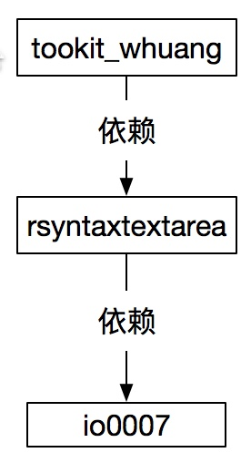
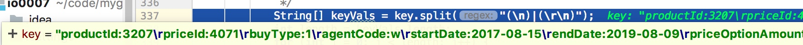

### **文本框快捷键** ###
1. cmd+M :弹出右键菜单;
2. cmd+L :最大化文本框;
3. cmd+R :使文本框只读;
4. cmd+E :使文本框可以编辑;
5. cmd+Enter :文本框可添加自定义事件;
6. cmd+F :搜索;
7. cmd+G :截图;
8. cmd+D :清空文本框;

# 依赖关系

# 注意:
1. java 编译级别必须是1.6,否则关于图形的类编译不通过
2. 里面有mac 相关的代码,所以在window中编译会报错,需要把mac 相关的代码注释掉

## 解决bug
修改com/swing/table/TableUtil3.java 中的方法getParameterIncludeBeans

